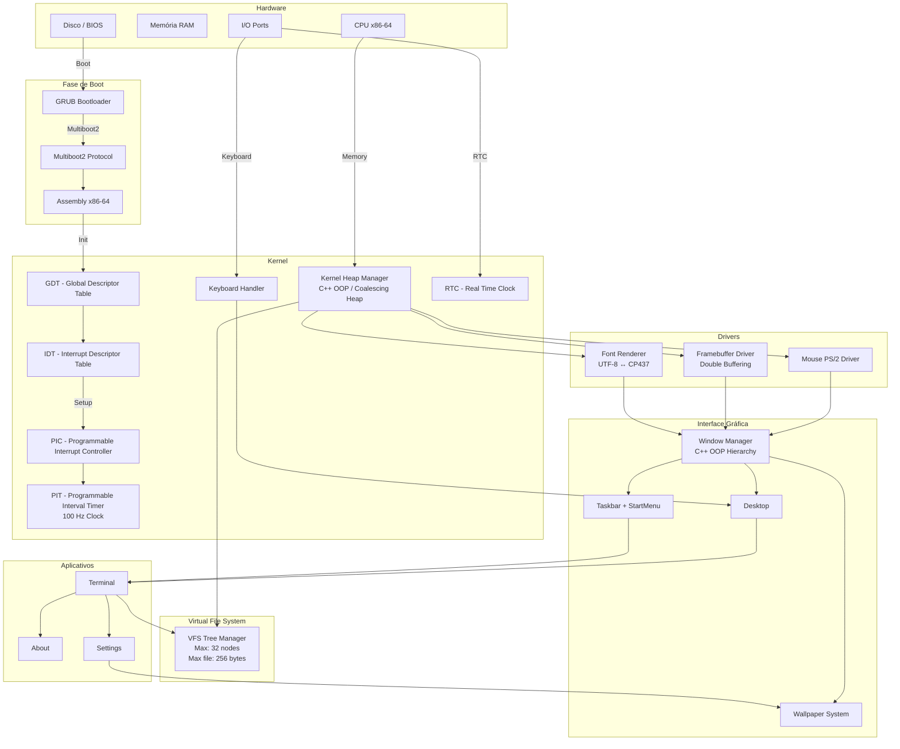
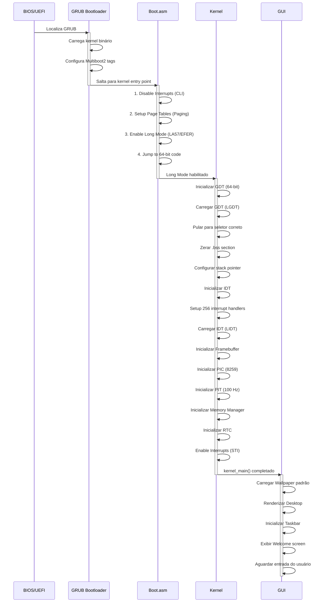
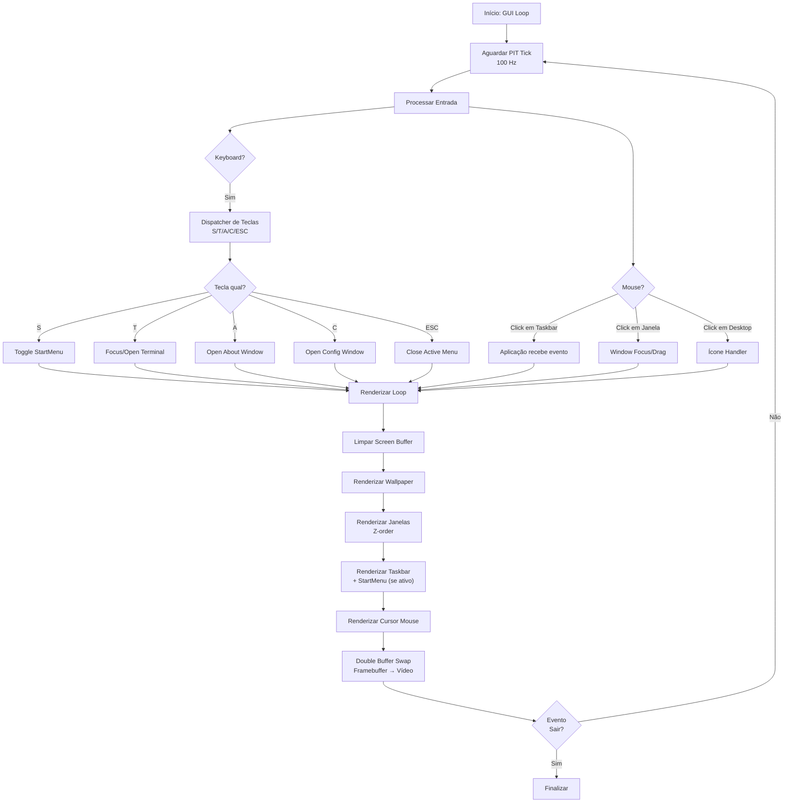
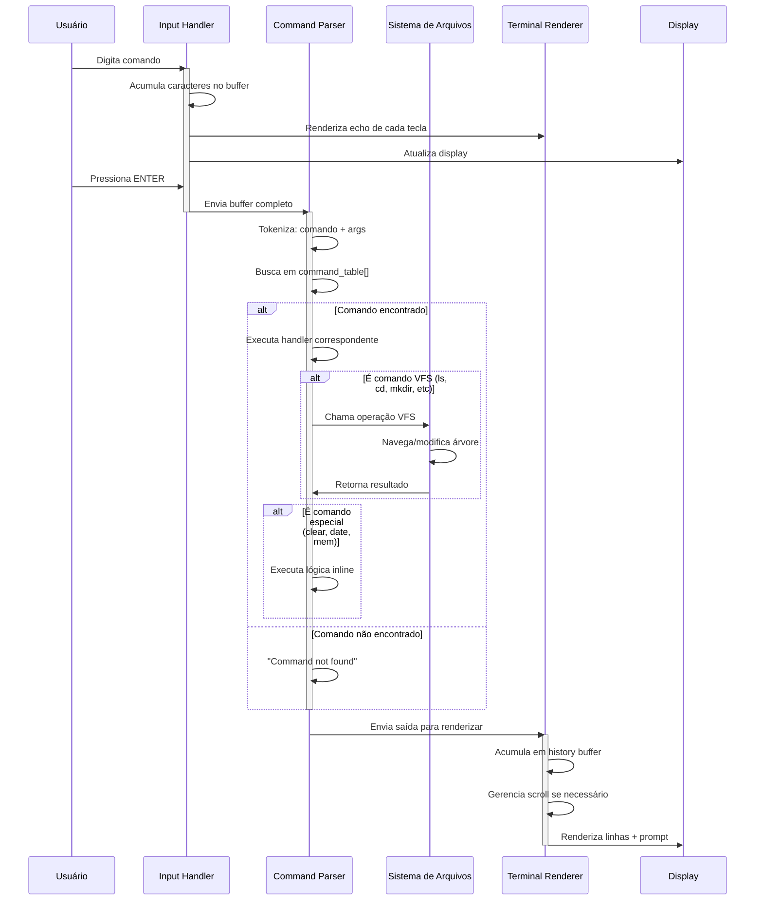
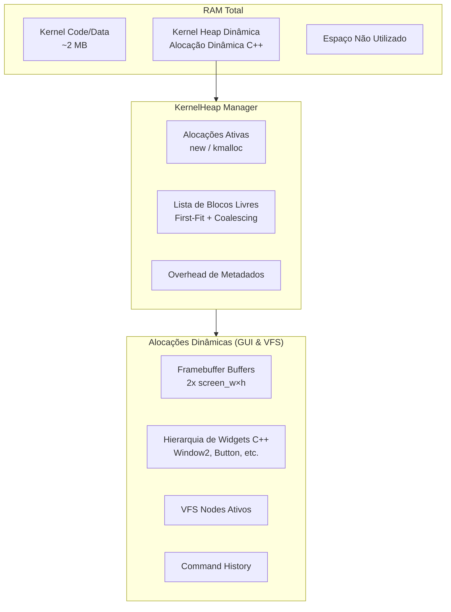
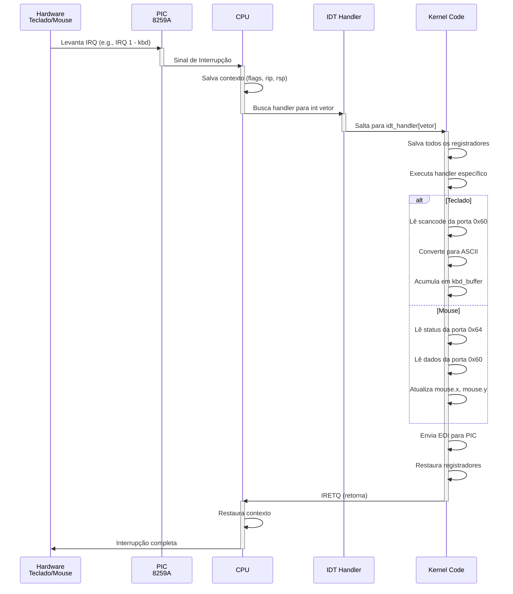

# Conteúdo dedicado estritamente aos diagramas e arquitetura detalhada

Este arquivo centraliza a modelagem de engenharia e diagramas de sequência do **HAOS**. Se você deseja entender como o sistema gerencia o hardware e renderiza componentes de software sob uma ótica interna, este guia descreve esses fluxos de maneira clara.

---

## 1. Arquitetura do Sistema e Componentes

Abaixo está o mapeamento estrutural detalhado de como os diferentes subsistemas interagem, desde a camada mais baixa de hardware até os aplicativos em C++ que rodam no espaço gráfico.

---

## 2. Fluxo de Inicialização (Boot Sequence)

Este diagrama mostra o ciclo de vida da inicialização a partir do firmware da máquina até a liberação completa da interface gráfica pronta para o usuário.

---

## 3. Fluxo Interno da Interface Gráfica (GUI Loop)

O gerenciamento de eventos de periféricos (Teclado e Mouse) e a pilha de renderização em camadas (*Z-Order*) com *Double Buffering* funcionam em ciclos síncronos:

---

## 4. Subsistema do Terminal e Interação com VFS

Este diagrama de sequência ilustra como a entrada bruta de texto do teclado é capturada, tratada pelo interpretador e integrada dinamicamente com o barramento do Sistema de Arquivos Virtual:

---

## 5. Gerenciamento e Estrutura da Heap Dinâmica

Como a nova estrutura em C++ organiza os buffers gráficos e os nós alocados pelo kernel de forma eficiente na memória RAM do sistema:

## 6. Tratamento de Interrupções de Hardware (Hardware Interrupts)

O ciclo de vida completo de um sinal gerado fisicamente pelos periféricos PS/2 (Teclado/Mouse) passando pela CPU e sendo tratado pelos rotinas de interrupção (ISRs):

