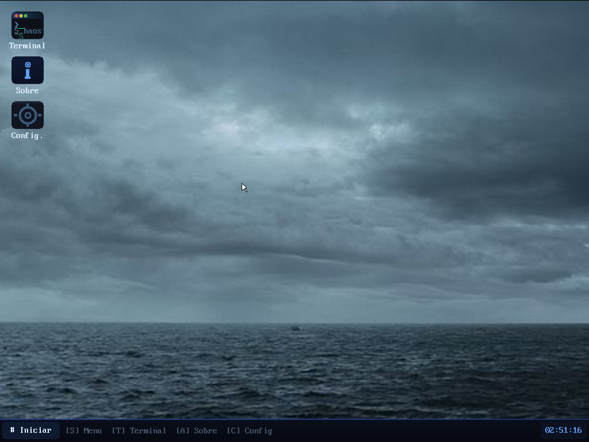
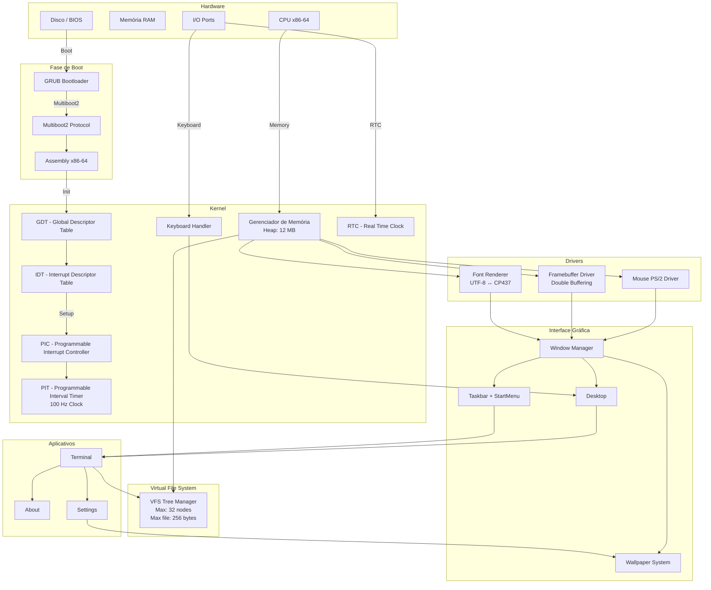
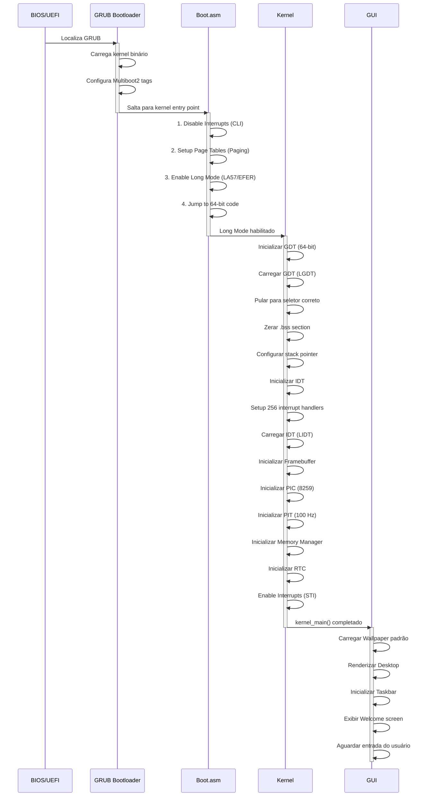
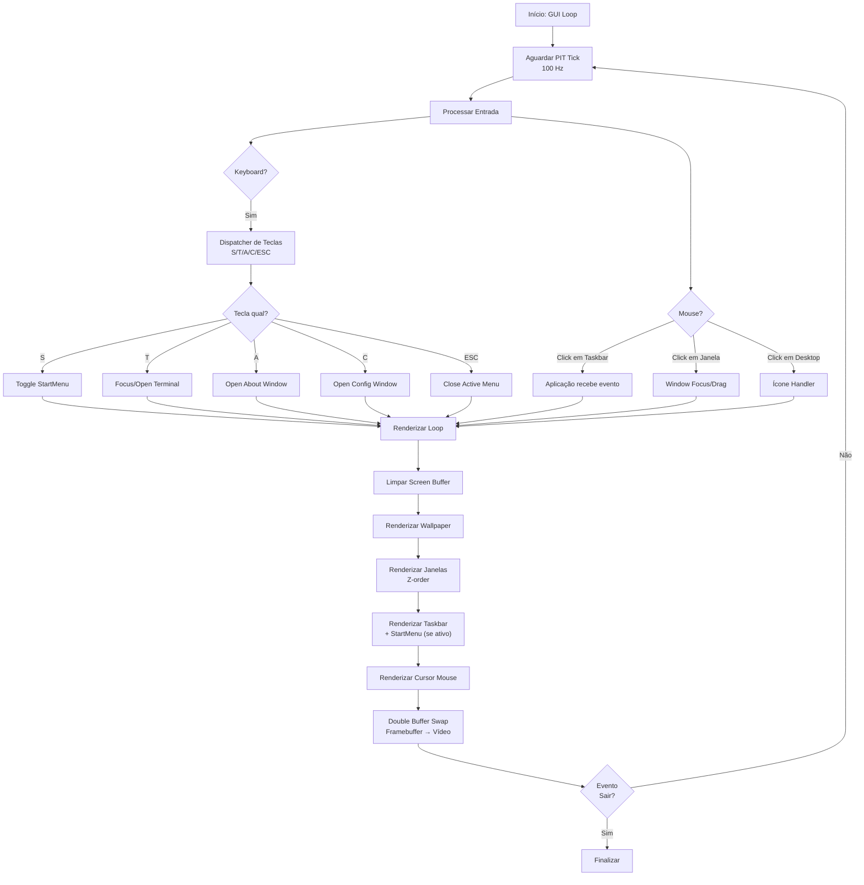
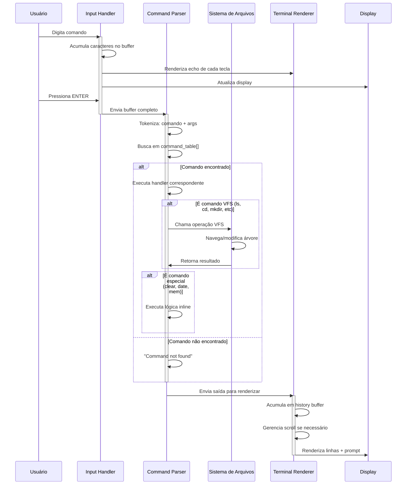
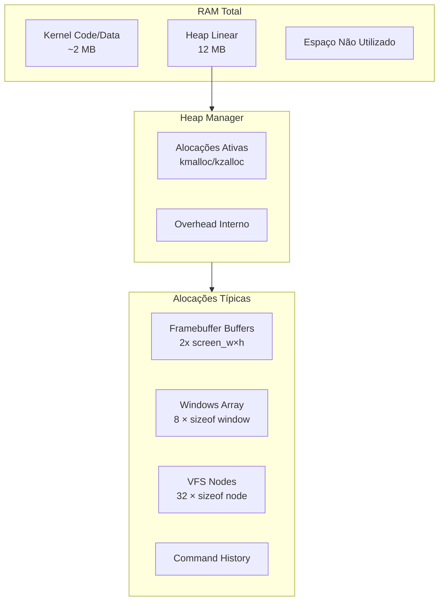
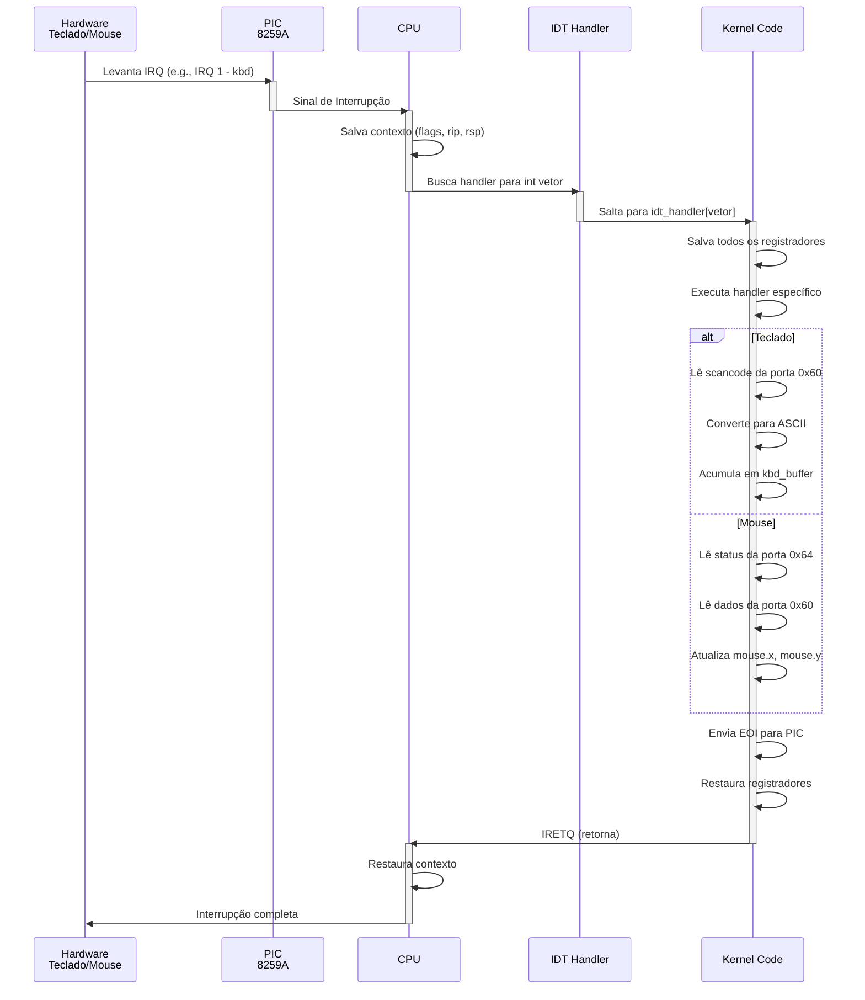

# HAOS — Home-built Operating System v1.1

[](https://en.wikipedia.org/wiki/X86-64)
[]()
[]()

O HAOS é um sistema operacional bare-metal de 64 bits desenvolvido de forma independente e educacional. O projeto visa a implementação de um núcleo funcional em arquitetura x86_64, utilizando C freestanding e Assembly, sem dependências de bibliotecas externas ou do sistema hospedeiro.

---



> UI do sistema

---

## Arquitetura do Sistema

### Diagrama de Componentes



---

##  Fluxo de Inicialização (Boot)



---

##  Fluxo da Interface Gráfica (GUI)




---

## Fluxo do Terminal



---

## Hierarquia de Memória



---

## Controladores de Hardware

### Sequência de Interrupção



---

## Recursos

### Kernel & Hardware
- **Kernel de 64 bits:** Operação em Long Mode com inicialização via Multiboot2 (GRUB).
- **GDT / IDT:** Tabelas de descritores e tratamento de interrupções configurados manualmente.
- **PIC / PIT:** Controlador de interrupções programável e timer de sistema a 100 Hz.
- **Gerenciamento de Memória:** Heap linear de 12 MB com `kmalloc` / `kzalloc` / `kfree`.
- **RTC:** Leitura do relógio de tempo real do hardware para exibição de data e hora.

### Drivers
- **Framebuffer:** Driver de vídeo direto com suporte a double-buffering (shadow + cache de fundo) para renderização sem flickering.
- **Teclado PS/2:** Driver completo com leitura de scancode e conversão de caracteres.
- **Mouse PS/2:** Captura de posição e botões com snapping de bordas.
- **Fontes & UTF-8:** Renderização de texto com fonte bitmap e conversão UTF-8 → CP437.

### Interface Gráfica (GUI)
- **Gerenciador de Janelas (WM):** Criação, foco, arraste pelo título e fechamento de janelas via mouse.
- **Desktop com Ícones:** Atalhos clicáveis para Terminal, Sobre e Configurações.
- **Taskbar:** Barra de tarefas com botão Iniciar, clock em tempo real e indicador da janela ativa.
- **Menu Iniciar:** Menu pop-up com acesso a aplicativos e opção de reinicialização.
- **Sistema de Wallpaper:** Suporte a gradiente padrão ou imagens convertidas, com três modos de exibição — Preencher, Centralizar e Lado a lado.
- **Cursor de Mouse:** Cursor renderizado em hardware com atualização por frame.
- **Limitador de FPS:** Renderização limitada a ~50 fps via tick do PIT.

### Aplicativos
- **Terminal:** Emulador de console interativo com histórico de comandos (teclas ↑/↓), scroll e cursor piscante.
- **Sobre:** Janela com informações de versão e créditos do sistema.
- **Configurações:** Janela de configuração do papel de parede com seleção de imagem e modo de exibição via teclado e mouse.

### Sistema de Arquivos (VFS)
- **Virtual File System:** Árvore de nós em memória com suporte a arquivos e diretórios.
- Operações disponíveis: criar, listar, navegar, ler, escrever, anexar conteúdo, remover e inspecionar metadados.

---

## Estrutura do Projeto

```text
haos/
├── boot/           # Código de inicialização e transição para Long Mode (ASM)
├── kernel/         # Núcleo: GDT, IDT, PIC, PIT, teclado, memória, RTC
├── drivers/        # Framebuffer, mouse, fonte, UTF-8↔CP437
├── fs/             # Virtual File System (VFS)
├── gui/
│   ├── apps/       # Terminal, Sobre, Configurações
│   ├── elements/   # Taskbar, Menu Iniciar, ícones do desktop
│   ├── screens/    # Boot screen, Welcome screen, Desktop loop
│   ├── gui.c       # Inicialização e loop principal da GUI
│   ├── wallpaper.c # Sistema de wallpaper (gradiente ou imagem)
│   └── window.c    # Gerenciador de janelas (WM)
├── tools/
│   └── img2wallpaper.py  # Ferramenta de conversão de imagens para wallpaper
├── iso/            # Configuração do GRUB para geração da imagem bootável
├── linker.ld       # Script de ligação para organização da memória
└── Makefile        # Automação de compilação e emulação
```

---

## Compilação e Execução

### Dependências (Ubuntu / Debian)

```bash
sudo apt install gcc-x86-64-linux-gnu nasm grub-pc-bin xorriso qemu-system-x86
```

### Comandos Principais

| Comando          | Descrição                                          |
|------------------|----------------------------------------------------|
| `make iso`       | Compila o kernel e gera a imagem `haos.iso`        |
| `make run`       | Inicia emulação via QEMU (GTK → SDL → VNC)         |
| `make run-gtk`   | Força saída via GTK (ideal para WSLg)              |
| `make run-sdl`   | Força saída via SDL                                |
| `make run-vnc`   | Executa sem display, acessível em `localhost:5900` |
| `make run-elf`   | Inicializa diretamente pelo ELF via QEMU           |
| `make debug`     | Modo debug com GDB server na porta 1234            |
| `make clean`     | Remove artefatos de compilação                     |
| `make wallpapers`| Recompila wallpapers convertidos                   |

### Adicionando Wallpapers

Use a ferramenta incluída para converter imagens:

```bash
python3 tools/img2wallpaper.py imagem.png assets/wallpapers/
```

Depois adicione o arquivo `.c` gerado em `WALLPAPER_SRCS` no `Makefile` e defina `-DHAOS_HAS_WALLPAPERS` nos `CFLAGS`.

---

## Atalhos de Teclado

| Tecla     | Ação                                   |
|-----------|----------------------------------------|
| `S`       | Alternar visibilidade do Menu Iniciar  |
| `T`       | Abrir / focar o Terminal               |
| `A`       | Abrir janela Sobre                     |
| `C`       | Abrir janela de Configurações          |
| `ESC`     | Fechar menu ativo                      |
| **Mouse** | Click para focar/arrastar janelas       |

---

## Comandos do Terminal

### Utilitários do Sistema

| Comando   | Descrição                              |
|-----------|----------------------------------------|
| `help`    | Lista todos os comandos disponíveis    |
| `clear`   | Limpa o buffer da tela                 |
| `about`   | Exibe versão e créditos                |
| `date`    | Data e hora atual (via RTC)            |
| `mem`     | Uso de memória da heap                 |
| `reboot`  | Reinicia o hardware                    |
| `echo`    | Imprime texto na saída do terminal     |
| `pwd`     | Exibe o diretório de trabalho atual    |

### Manipulação de Arquivos (VFS)

| Comando              | Descrição                              |
|----------------------|----------------------------------------|
| `ls [dir]`           | Lista conteúdo do diretório            |
| `cd <dir>`           | Navega para o diretório                |
| `mkdir <nome>`       | Cria um novo diretório                 |
| `touch <nome>`       | Cria arquivo vazio                     |
| `write <arq> <texto>`| Escreve conteúdo no arquivo            |
| `append <arq> <texto>`| Adiciona conteúdo ao arquivo          |
| `cat <arq>`          | Exibe o conteúdo do arquivo            |
| `stat <arq>`         | Exibe metadados do nó VFS              |
| `rm <nome>`          | Remove arquivo ou diretório            |

---

## Limitações Técnicas

1. **Volatilidade:** O sistema de arquivos opera estritamente em RAM; dados não são persistidos em disco após reinicialização.
2. **Escalabilidade:** O VFS está limitado a um máximo de 32 nós (arquivos ou diretórios).
3. **Capacidade:** O tamanho máximo por arquivo é de 256 bytes.
4. **Heap:** A memória alocável é limitada a 12 MB e não possui liberação real (`kfree` é no-op).

---

## Referências

- [OSDev Wiki](https://wiki.osdev.org/)
- [Multiboot2 Specification](https://www.gnu.org/software/grub/manual/multiboot2/multiboot.html)