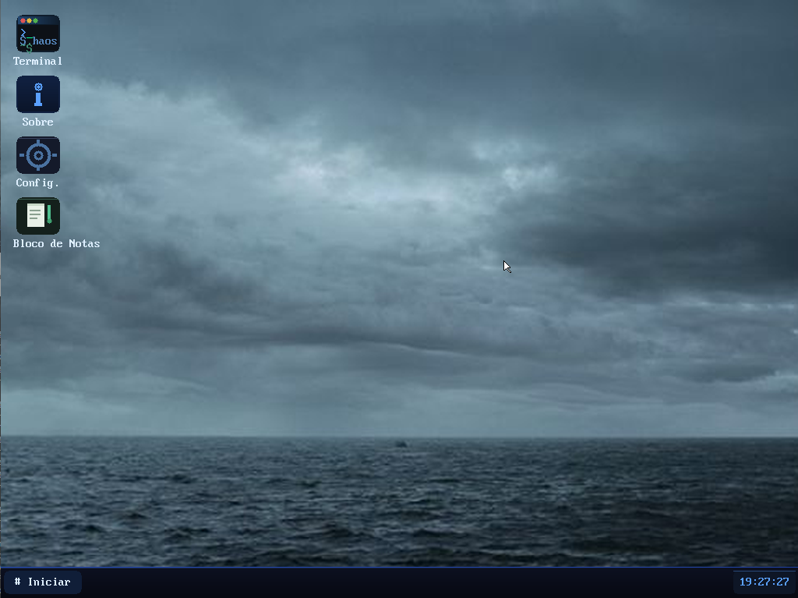

# HAOS

[](https://en.wikipedia.org/wiki/X86-64)
[]()
[]()

O HAOS é um sistema operacional bare-metal de 64 bits desenvolvido de forma independente e educacional. O projeto visa a implementação de um núcleo funcional em arquitetura x86_64, utilizando C freestanding, Assembly e C++, sem dependências de bibliotecas externas ou do sistema hospedeiro.

---



> Interface do sistema em execução

---

## Recursos Implementados

### Kernel & Hardware
- **Kernel de 64 bits:** Operação em Long Mode com inicialização via Multiboot2 (GRUB).
- **GDT / IDT:** Tabelas de descritores e tratamento de interrupções configurados manualmente.
- **PIC / PIT:** Controlador de interrupções programável e timer de sistema a 100 Hz.
- **Gerenciamento Avançado de Memória:**
  - **PageFrameAllocator (PFA):** Alocação de páginas físicas via bitmap, usando o mapa de memória do Multiboot2.
  - **KernelHeap:** Alocador *First-Fit* com coalescência automática (fusão de blocos livres adjacentes).
  - **Operadores globais new/delete:** Sobrecarga completa para alocação dinâmica em C++ (`new`, `new[]`, `delete`, `delete[]`).
  - **API C:** `kmalloc`, `kzalloc`, `kfree` e utilitários de string (`kstrcpy`, `kstrcat`, `kitoa`, etc.).
- **RTC:** Leitura do relógio de tempo real do hardware para exibição de data e hora.
- **Sysinfo:** Detecção de CPU via instrução CPUID (vendor, brand string e número de núcleos).

### Drivers
- **Framebuffer:** Driver de vídeo direto com double-buffering (shadow + cache de fundo) para renderização sem flickering.
- **Teclado PS/2:** Driver completo com leitura de scancode, conversão de caracteres, suporte a Shift, Caps Lock, Ctrl e setas (com e sem Shift para seleção de texto).
- **Mouse PS/2:** Captura de posição e botões com snapping de bordas.
- **Fontes & UTF-8:** Renderização de texto com fonte bitmap 8×16 (CP437) e conversão UTF-8 → CP437, com suporte a acentos portugueses e caracteres box-drawing.
- **RTC:** Leitura e formatação de data/hora em tempo real.

### Interface Gráfica (GUI)
- **Gerenciador de Janelas (WM):** Sistema de janelas com foco, arraste pelo título, minimização, fechamento e ordem de empilhamento.
- **Widgets OOP (C++):** Hierarquia orientada a objetos com `Widget` (base abstrata), `Button`, `Label` e `Window2` (contêiner).
- **Desktop com Ícones:** Atalhos clicáveis para Terminal, Sobre, Configurações e Bloco de Notas.
- **Taskbar:** Barra de tarefas com botão Iniciar, clock em tempo real e indicador da janela ativa.
- **Menu Iniciar:** Menu pop-up com acesso a aplicativos e opção de reinicialização.
- **Sistema de Wallpaper:** Suporte a gradiente padrão ou imagens convertidas, com três modos de exibição — Preencher, Centralizar e Lado a lado.
- **Cursor de Mouse:** Cursor renderizado em hardware com atualização por frame.
- **Limitador de FPS:** Renderização limitada a ~50 fps via tick do PIT.

### Aplicativos
- **Terminal:** Emulador de console interativo com histórico de comandos (teclas ↑/↓), scroll, cursor piscante e suporte a comandos de sistema e VFS.
- **Bloco de Notas (Editor):** Editor de texto multi-linha com cursor navegável (setas), seleção de texto (Shift+setas e mouse), copiar/colar/recortar (Ctrl+C/V/X), selecionar tudo (Ctrl+A), salvar (Ctrl+S ou F2) e diálogo "salvar como" integrado ao VFS.
- **Sobre:** Janela com informações de versão, arquitetura, boot, vídeo, GUI, input e kernel.
- **Configurações:** Janela para seleção de wallpaper, modo de exibição e idioma (Português/English), com informações de hardware (CPU, RAM, heap).

### Sistema de Arquivos (VFS)
- **Virtual File System:** Árvore de nós em memória com suporte a arquivos e diretórios.
  - **Limites:** Nome de arquivo: 64 caracteres; Máx. arquivos por diretório: 128; Tamanho máximo por arquivo: 1 MB (crescimento dinâmico).
- **Operações disponíveis:** criar, listar, navegar, ler, escrever, anexar conteúdo, remover e inspecionar metadados.

### Internacionalização (i18n)
- **Suporte a múltiplos idiomas:** Português (Brasil) e Inglês, com alternância em tempo de execução.
- **Tabelas de strings centralizadas:** Todas as mensagens da UI e do terminal são traduzíveis via `tr(STR_ID)`.

---

## Estrutura do Projeto

```
├── boot/           # Código de inicialização e transição para Long Mode (ASM)
├── kernel/         # Núcleo: GDT, IDT, PIC, PIT, teclado, memória, RTC
├── drivers/        # Framebuffer, mouse, fonte, UTF-8↔CP437
├── fs/             # Virtual File System (VFS)
├── gui/
│   ├── apps/       # Terminal, Sobre, Configurações
│   ├── elements/   # Taskbar, Menu Iniciar, ícones do desktop, Widgets base (C++)
│   ├── screens/    # Boot screen, Welcome screen, Desktop loop
│   ├── gui.cpp     # Inicialização e loop principal da GUI em C++
│   ├── wallpaper.cpp # Sistema de wallpaper (gradiente ou imagem)
│   └── window.cpp    # Gerenciador de janelas e componentes gráficos (WM)
├── tools/
│   └── img2wallpaper.py  # Ferramenta de conversão de imagens para wallpaper
├── iso/            # Configuração do GRUB para geração da imagem bootável
├── linker.ld       # Script de ligação para organização da memória 
└── Makefile        # Automação de compilação e emulação
```

---

## Compilação e Execução

### Dependências (Ubuntu / Debian)

```bash
sudo apt install gcc-x86-64-linux-gnu g++-x86-64-linux-gnu nasm grub-pc-bin xorriso qemu-system-x86 python3-pip
pip3 install Pillow
```

### Comandos Principais

| Comando | Descrição |
| --- | --- |
| `make iso` | Compila o kernel e gera a imagem `haos.iso` |
| `make run` | Inicia emulação via QEMU (GTK → SDL → VNC) |
| `make run-gtk` | Força saída via GTK (ideal para WSLg) |
| `make run-sdl` | Força saída via SDL |
| `make run-vnc` | Executa sem display, acessível em `localhost:5900` |
| `make run-elf` | Inicializa diretamente pelo ELF via QEMU |
| `make debug` | Modo debug com GDB server na porta 1234 |
| `make clean` | Remove artefatos de compilação |
| `make wallpapers` | Recompila wallpapers convertidos |

### Adicionando Wallpapers

Use a ferramenta incluída para converter imagens:

```bash
# Converte uma única imagem
python3 tools/img2wallpaper.py assets/minha_imagem.png

# Converte todas as imagens de uma pasta
python3 tools/img2wallpaper.py assets/imagens/

# Especifica resolução (padrão: 1024×768)
python3 tools/img2wallpaper.py imagem.png --width 1920 --height 1080
```

Após converter, adicione os arquivos `.c` gerados ao `Makefile` em `WALLPAPER_SRCS` e compile com `make wallpapers`.

---

## Atalhos de Teclado

| Tecla | Ação |
| --- | --- |
| `S` | Alternar visibilidade do Menu Iniciar |
| `T` | Abrir / focar o Terminal |
| `A` | Abrir janela Sobre |
| `C` | Abrir janela de Configurações |
| `E` | Abrir Bloco de Notas |
| `ESC` | Fechar menu ativo / janela |
| **Mouse** | Clique para focar/arrastar janelas |

### Editor de Texto (Bloco de Notas)

| Tecla | Ação |
| --- | --- |
| `←/↑/↓/→` | Mover cursor |
| `Shift+←/↑/↓/→` | Estender seleção |
| `Ctrl+A` | Selecionar todo o texto |
| `Ctrl+C` | Copiar seleção |
| `Ctrl+X` | Recortar seleção |
| `Ctrl+V` | Colar |
| `Ctrl+S` / `F2` | Salvar arquivo |
| `ESC` | Fechar (ou cancelar "salvar como") |

---

## Comandos do Terminal

### Utilitários do Sistema

| Comando | Descrição |
| --- | --- |
| `help` | Lista todos os comandos disponíveis |
| `clear` | Limpa o buffer da tela |
| `about` | Exibe versão e créditos |
| `date` | Data e hora atual |
| `mem` | Uso em tempo real da Heap do Kernel |
| `reboot` | Reinicia o hardware |
| `echo <texto>` | Imprime texto na saída do terminal |
| `lang <pt\|en>` | Altera o idioma do sistema |

### Manipulação de Arquivos (VFS)

| Comando | Descrição |
| --- | --- |
| `pwd` | Exibe o diretório de trabalho atual |
| `ls [dir]` | Lista conteúdo do diretório |
| `cd <dir>` | Navega para o diretório |
| `mkdir <nome>` | Cria um novo diretório |
| `touch <nome>` | Cria arquivo vazio |
| `write <arq> <texto>` | Escreve conteúdo no arquivo |
| `append <arq> <texto>` | Adiciona conteúdo ao arquivo |
| `cat <arq>` | Exibe o conteúdo do arquivo |
| `stat <arq>` | Exibe metadados do nó VFS |
| `rm <nome>` | Remove arquivo ou diretório |
| `edit <nome>` | Abre o Bloco de Notas com o arquivo |

---

## Limitações Técnicas Atuais

1. **Volatilidade:** O sistema de arquivos opera estritamente em RAM; dados não são persistidos em disco após reinicialização.
2. **Escalabilidade do FS:** Limite de 128 itens por diretório e 1 MB por arquivo.
3. **Isolamento de Processos:** O sistema opera integralmente em Ring 0 (Kernel Mode) sem separação de espaço de usuário e multitarefa preemptiva.
4. **Memória:** A heap do kernel cresce dinamicamente via PFA, mas não há suporte a memória virtual avançada (paging apenas para mapeamento identity).
5. **Drivers:** Limitado a PS/2 para entrada e VESA para vídeo; sem suporte a USB, PCI, ACPI avançado ou som.

---

## Documentação Adicional

Para entender os fluxos de inicialização, a arquitetura visual interna e o funcionamento dos controladores, veja o arquivo [ARCHITECTURE.md](ARCHITECTURE.md).

---

## Referências

* [OSDev Wiki](https://wiki.osdev.org/)
* [Multiboot2 Specification](https://www.gnu.org/software/grub/manual/multiboot2/multiboot.html)
* [Intel 64 and IA-32 Architectures Software Developer Manuals](https://www.intel.com/content/www/us/en/developer/articles/technical/intel-sdm.html)
* [CPUID Instruction](https://en.wikipedia.org/wiki/CPUID)